# 
 Laboratorio sqoop y hive 

## Traer los datos del dataset en s3
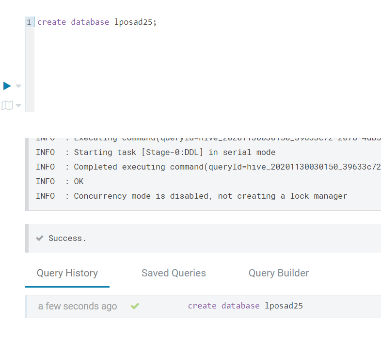

## Agregar columnas y eliminar columnas
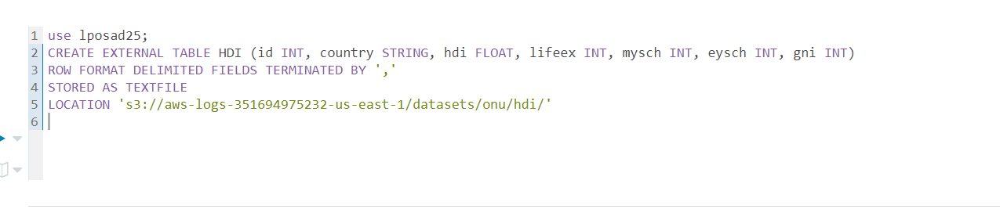

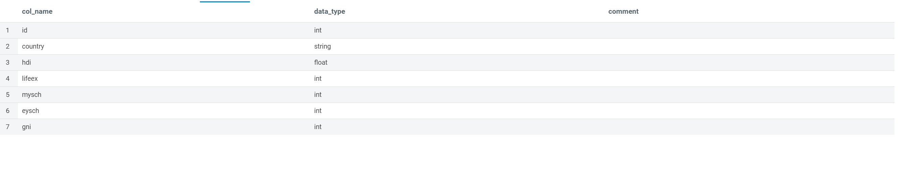

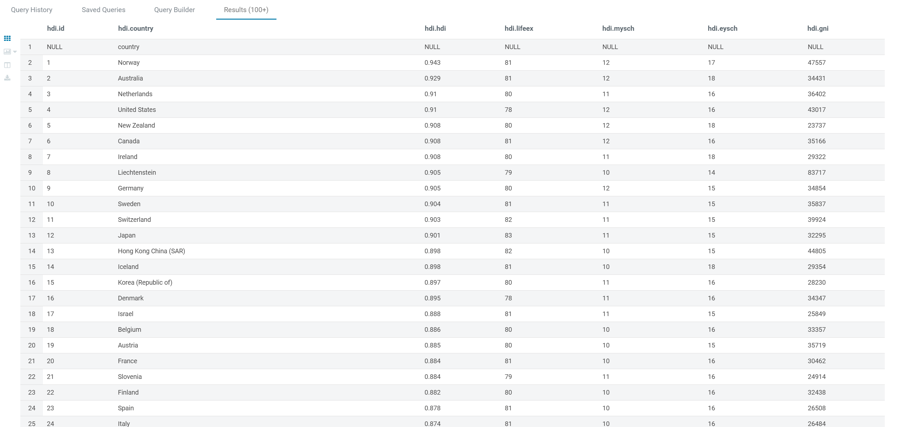

## Filtrar datos
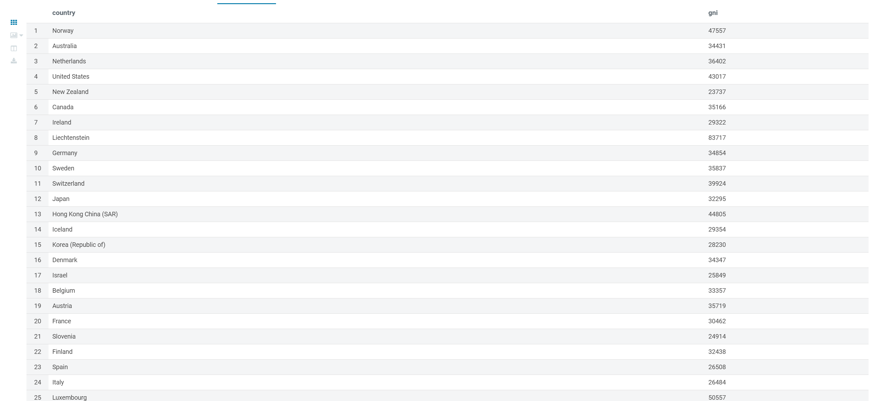

## Agrupación y conteo de datos
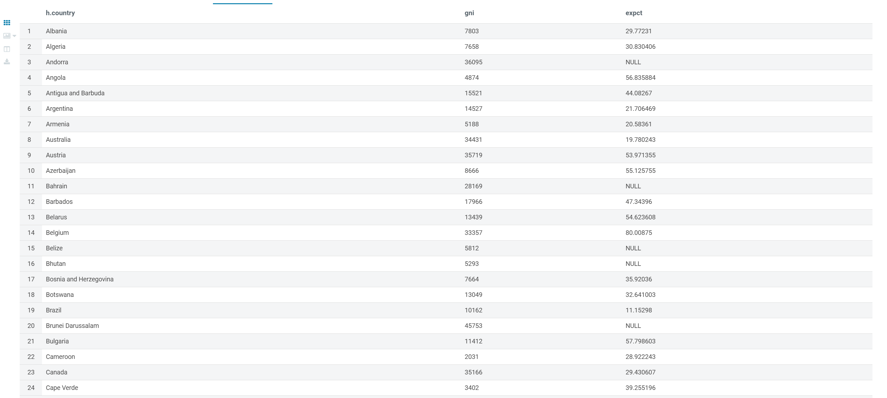

## Subir datos a s3
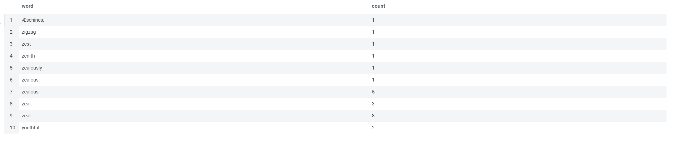

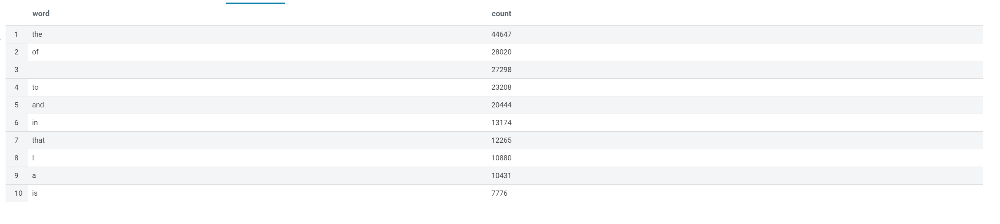

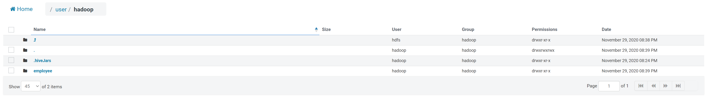

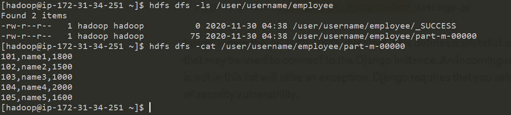

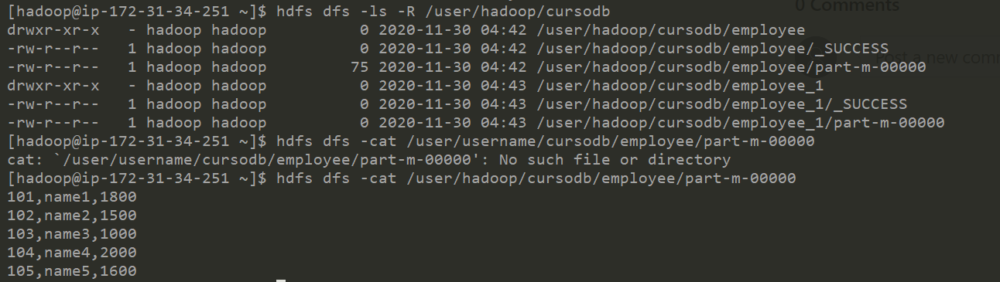

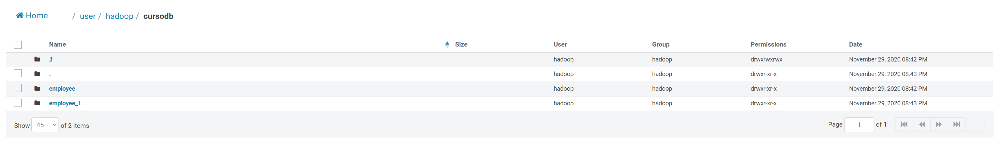

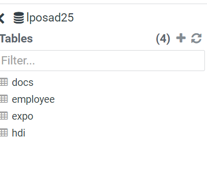

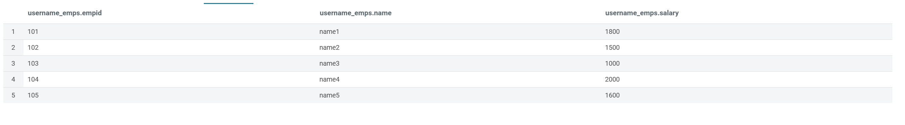

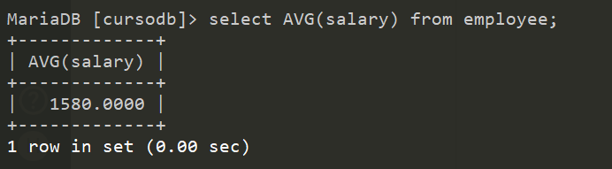

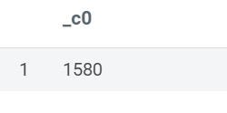
